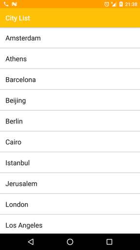
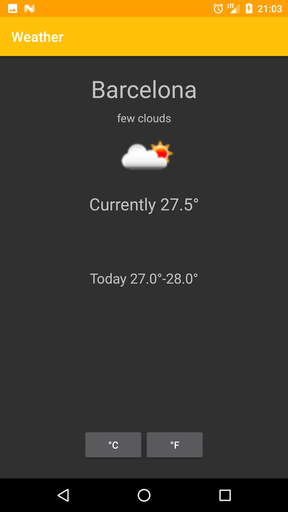

WeatherApp-CleanArchitecture 
=========================
WeatherApp is an android app that lets you check the current weather for selected cities around the world using [Open Weather Map API](http://openweathermap.org/api).

The application was built with Uncle Bob's clean architecture approach, and deeply inspired by
[Fernando Cejas Android-CleanArchitecture](https://github.com/android10/Android-CleanArchitecture) sample.

Screenshots
------------------------------------
 

Libraries used on this project
------------------------------------
**Development**
* RxJava & RxAndroid
* RxBinding
* Dagger 2
* Retrofit 2
* OkHttp 3
* AndroidAnnotations
* ButterKnife
* Glide
* LeakCanary
* ConstraintLayout
* RecyclerView

**Testing**
* Junit
* Mockito
* Hamcrest
* Espresso
* AssertJ

Architecture
------------------------------------

  
  
[Architecting Android…The clean way?](http://fernandocejas.com/2014/09/03/architecting-android-the-clean-way/)

[Architecting Android…The evolution](http://fernandocejas.com/2015/07/18/architecting-android-the-evolution/)

[Tasting Dagger 2 on Android](http://fernandocejas.com/2015/04/11/tasting-dagger-2-on-android/)

[Clean Architecture…Dynamic Parameters in Use Cases](http://fernandocejas.com/2016/12/24/clean-architecture-dynamic-parameters-in-use-cases/)

[Demo video of this sample](http://youtu.be/XSjV4sG3ni0)

Clean architecture
-----------------

Architectural approach
-----------------

Architectural reactive approach
-----------------

Local Development
-----------------

Here are some useful Gradle/adb commands for executing this example:

 * `./gradlew clean build` - Build the entire example and execute unit and integration tests plus lint check.
 * `./gradlew installDebug` - Install the debug apk on the current connected device.
 * `./gradlew runUnitTests` - Execute domain and data layer tests (both unit and integration).
 * `./gradlew runAcceptanceTests` - Execute espresso and instrumentation acceptance tests.
 
License
--------

    Copyright 2016 Fernando Cejas

    Licensed under the Apache License, Version 2.0 (the "License");
    you may not use this file except in compliance with the License.
    You may obtain a copy of the License at

       http://www.apache.org/licenses/LICENSE-2.0

    Unless required by applicable law or agreed to in writing, software
    distributed under the License is distributed on an "AS IS" BASIS,
    WITHOUT WARRANTIES OR CONDITIONS OF ANY KIND, either express or implied.
    See the License for the specific language governing permissions and
    limitations under the License.
 
